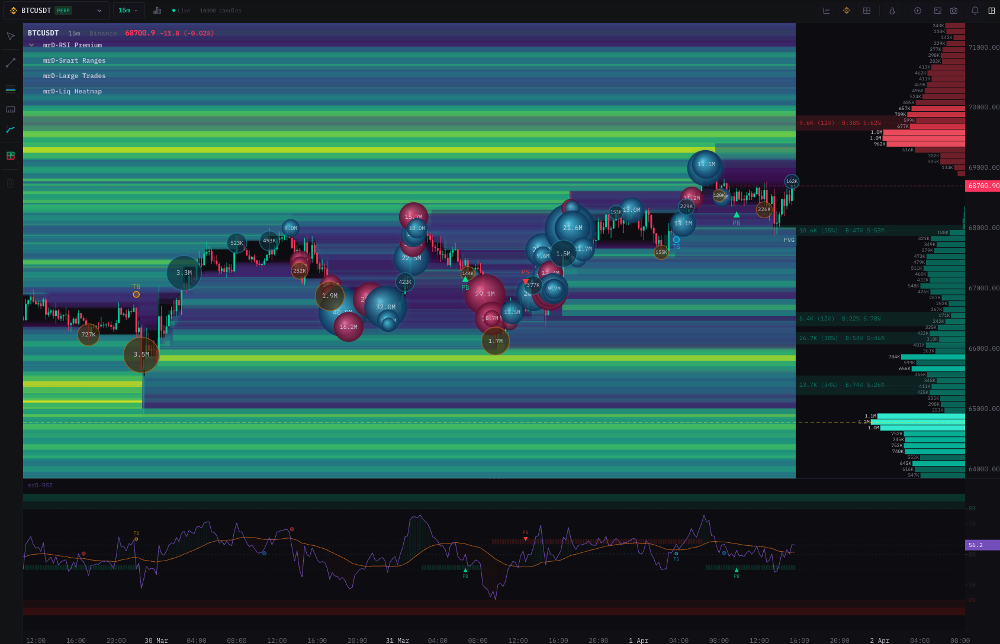
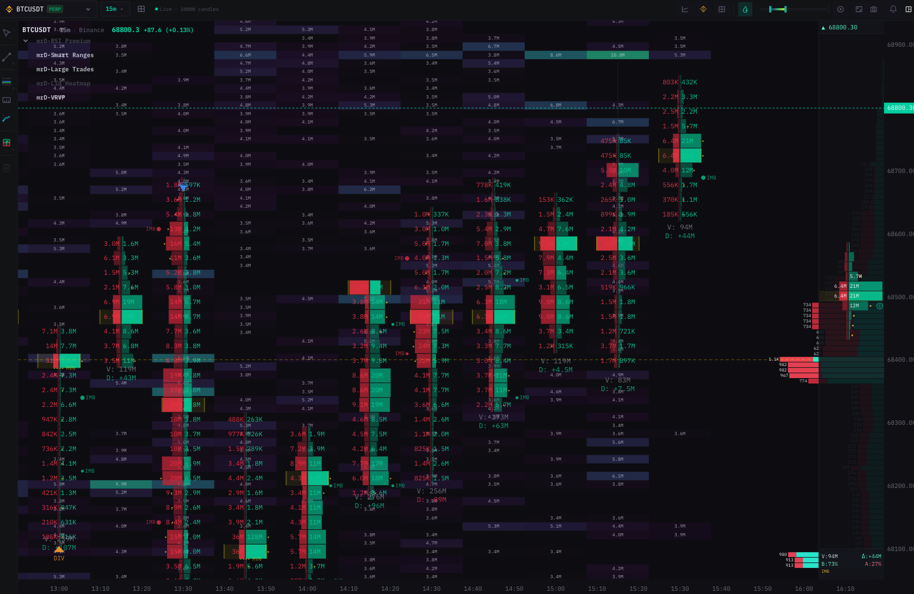
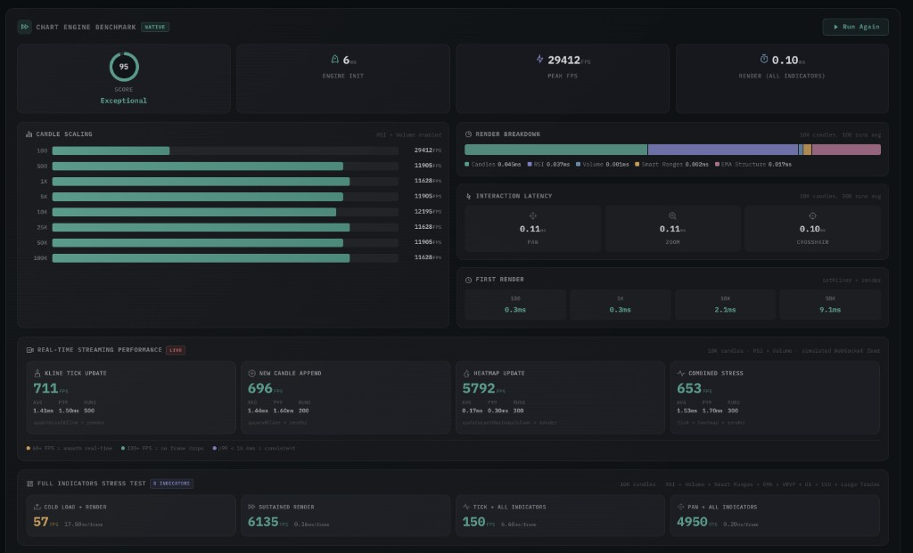

<p align="center">
  
</p>

<h1 align="center">Kline Orderbook Chart</h1>

<p align="center">
  <strong>The only chart library with built-in orderbook heatmap, footprint chart, and liquidation heatmap<br/>all in one <code>&lt;canvas&gt;</code>, powered by a native high-performance engine</strong>
</p>

<p align="center">
  <a href="https://app.mrd-indicators.com/trading/chart-terminal">Live Demo</a>&nbsp;&nbsp;&bull;&nbsp;&nbsp;
  <a href="#run-demo-locally">Run Demo Locally</a>&nbsp;&nbsp;&bull;&nbsp;&nbsp;
  <a href="#documentation">Documentation</a>&nbsp;&nbsp;&bull;&nbsp;&nbsp;
  <a href="https://discord.gg/buX2h5ZZm">Discord</a>&nbsp;&nbsp;&bull;&nbsp;&nbsp;
  <a href="https://x.com/mrDocTradingIO">X</a>&nbsp;&nbsp;&bull;&nbsp;&nbsp;
  <a href="mailto:support@mrd-indicators.com">Contact</a>
</p>

<p align="center">
  <a href="https://www.npmjs.com/package/kline-orderbook-chart"></a>
  <a href="https://www.npmjs.com/package/kline-orderbook-chart"></a>
  
  
  
  
</p>

---

## The problem

You need a candlestick chart that also renders **real-time orderbook depth as a heatmap** behind the candles. You search for "orderbook heatmap chart library" or "kline heatmap javascript" — and find nothing. Every existing charting library gives you candles OR a heatmap, never both rendered together in a single performant canvas.

Building it yourself means months of work: Canvas rendering, depth matrix management, color mapping, scroll sync, zoom, crosshair, touch events, and performance optimization for hundreds of thousands of data points updating in real-time.

**Kline Orderbook Chart solves this.** One npm install. One `<canvas>`. Candlesticks with orderbook heatmap, footprint chart, liquidation heatmap, and 12+ indicators — all rendered at 60 fps by a native high-performance engine.

---

## See it in action

<p align="center">
  
</p>

<p align="center">
  <em>BTC/USDT — Candlestick + Orderbook Heatmap + Large Trade Bubbles + Liquidation Heatmap + RSI with signals</em>
</p>

<p align="center">
  
</p>

<p align="center">
  <em>BTC/USDT — Footprint chart with bid/ask volume at every price level, POC, delta, VRVP profile panel</em>
</p>

> **Video demos:** See the full interactive experience in the [`assets/media/`](assets/media/) folder — real-time orderbook heatmap streaming, drawing tools, theme switching, and more.

---

## What makes this different

### Orderbook Heatmap + Candlestick — in one chart

No other charting library renders orderbook depth data as a heatmap layer behind candlesticks. This library takes a real-time depth matrix (price levels x time columns) and renders it as a color-mapped heatmap with adaptive intensity — while simultaneously drawing candles, volume, and all your indicators on top. One canvas, one render loop, zero lag.

### Footprint Chart — built-in, not a plugin

Bid/ask volume at every price level, rendered inline on each candle. Delta coloring, imbalance dot detection, POC (Point of Control) highlighting, and a full volume profile panel on the right side. This is the same visualization prop trading firms pay thousands for — now embeddable in any web app.

### Liquidation Heatmap

Estimated liquidation level clusters rendered as a heat overlay. See where leveraged positions are concentrated and where cascading liquidations may trigger — directly on the price chart.

### Native Performance

The entire computation pipeline — indicator math, heatmap color mapping, viewport transforms, hit testing — runs in a native-compiled engine. JavaScript only handles Canvas 2D draw calls via a zero-copy binary command protocol. The result:

- **60 fps** with 100K+ candles and a 500x200 heatmap matrix updating in real-time
- **~12 MB memory** at 50K candles (vs 50-120 MB for JS-only libraries)
- **Near-zero GC pressure** — no jank from garbage collection pauses
- **380 KB gzip** total bundle

### Framework Agnostic

Give it a `<canvas>` element. It works with React, Vue, Svelte, Angular, or vanilla JavaScript. No framework lock-in, no virtual DOM overhead.

---

## Benchmark

<p align="center">
  
</p>

Real benchmark from the built-in performance suite, measured on a standard desktop (M-series Mac, Chrome):

### Engine Init & Rendering

| Metric | Result |
|---|---|
| **Engine init** | **6 ms** |
| **Peak FPS** | **29,412 fps** |
| **Render (all indicators)** | **0.10 ms/frame** |
| **Benchmark score** | **95 / 100 — Exceptional** |

### Candle Scaling (RSI + Volume enabled)

| Candle count | FPS |
|---|---|
| 100 | 29,412 |
| 500 | 11,905 |
| 1K | 11,628 |
| 5K | 11,905 |
| 10K | 12,195 |
| 25K | 11,628 |
| 50K | 11,905 |
| 100K | 11,628 |

FPS stays above **11,000** even at 100K candles — essentially **zero performance degradation** at scale.

### Render Breakdown (10K candles, 100 bars avg)

| Component | Time |
|---|---|
| Candles | 0.045 ms |
| RSI | 0.027 ms |
| Volume | 0.081 ms |
| Smart Ranges | 0.002 ms |
| EMA Structure | 0.017 ms |
| **Total** | **0.10 ms** |

### Interaction Latency (10K candles, 200 bars avg)

| Action | Latency |
|---|---|
| Pan | 0.11 ms |
| Zoom | 0.11 ms |
| Crosshair | 0.10 ms |

Sub-millisecond response for all user interactions.

### First Render Time

| Candle count | Time |
|---|---|
| 100 | 0.3 ms |
| 1K | 0.3 ms |
| 10K | 2.1 ms |
| 50K | 9.1 ms |

50,000 candles render in **under 10 ms** on first load.

### Real-Time Streaming Performance (10K candles, RSI + Volume, simulated WebSocket feed)

| Operation | FPS | Latency |
|---|---|---|
| Kline tick update | 711 fps | 1.41 ms avg |
| New candle append | 696 fps | 1.44 ms avg |
| Heatmap update | 5,792 fps | 0.17 ms avg |
| Combined stress | 653 fps | 1.53 ms avg |

All real-time operations maintain **60+ fps** with headroom to spare. Heatmap updates run at nearly **6,000 fps**.

### Full Indicator Stress Test (8 indicators: RSI + Volume + Smart Ranges + EMA + VRVP + OI + CVD + Large Trades)

| Test | Result |
|---|---|
| Cold load + render | 57 fps, 17.98 ms/frame |
| Sustained render | 6,135 fps, 0.16 ms/frame |
| Tick + all indicators | 150 fps, 6.68 ms/frame |
| Pan + all indicators | 4,950 fps, 0.20 ms/frame |

Even with **8 indicators active simultaneously** on 10K candles, sustained rendering runs at **6,135 fps**.

---

## Full Feature Set

<table>
<tr>
<td width="50%">

### Order Flow Visualization
- **Orderbook Heatmap** — real-time depth matrix behind candles
- **Footprint Chart** — bid/ask volume, delta, imbalance, POC
- **Liquidation Heatmap** — leveraged position cluster overlay
- **VRVP** — Visible Range Volume Profile
- **TPO / Market Profile** — time-at-price distribution
- **Large Trade Bubbles** — whale order visualization

</td>
<td width="50%">

### Technical Indicators
- **RSI** with divergence detection & pullback signals
- **Open Interest** with delta tracking
- **Cumulative Volume Delta (CVD)**
- **Funding Rate** overlay
- **EMA Structure** — multi-period trend strength
- **Custom Indicator Plugin API** — build your own

</td>
</tr>
<tr>
<td>

### Drawing & Interaction
- 10+ tools: Trendline, Fibonacci, Channel, Pitchfork, Elliott Wave, Brush, Rectangle, Path, and more
- Full JSON export/import for persistence
- Multi-pane crosshair sync
- Rich tooltip with OHLCV + indicator data
- Bar replay mode

</td>
<td>

### Core Charting
- Candlestick, Heikin-Ashi, Line, Area chart types
- Volume histogram with climax detection
- Responsive time & price axes with auto-scaling
- Dark, light, and fully custom themes
- Smooth pan, pinch-zoom, mouse wheel zoom
- Touch-optimized for mobile & tablet

</td>
</tr>
</table>

---

## Quick Start

### Install

```bash
npm install kline-orderbook-chart
```

### Basic usage

```javascript
import { createChartBridge, prefetchWasm } from 'kline-orderbook-chart'

// Pre-load engine for faster first render (optional)
prefetchWasm()

// Create chart
const canvas = document.getElementById('chart')
const chart = await createChartBridge(canvas, {
  licenseKey: 'YOUR_LICENSE_KEY',   // omit for 14-day trial
})

// Load data (six separate arrays)
chart.setKlines(
  [1710000000, 1710003600],   // timestamps (seconds)
  [65200, 65600],             // opens
  [65800, 66100],             // highs
  [65100, 65400],             // lows
  [65600, 65900],             // closes
  [1234.5, 987.2],            // volumes
)
chart.setCandleInterval(3600)
chart.setPrecision(1)

// Enable indicators
chart.enableVolume()
chart.enableRsi()
chart.setRsiPeriod(14)

// Start rendering
chart.start()

// Real-time update
ws.onmessage = (e) => {
  const { k } = JSON.parse(e.data)
  chart.updateLastKline(Math.floor(k.t / 1000), +k.o, +k.h, +k.l, +k.c, +k.v)
}
```

### Enable orderbook heatmap

```javascript
const yStep = (priceMax - priceMin) / rows
const xStep = (timeEnd - timeStart) / cols

chart.setHeatmap(
  depthMatrix,     // Float64Array — flattened row-major
  200,             // rows (price levels)
  100,             // cols (time columns)
  timeStart,       // timestamp of first column (seconds)
  xStep,           // time interval between columns
  priceMin,        // price of first row
  yStep,           // price interval between rows
)
```

---

## Run Demo Locally

Download and run the demo project — no API keys needed, uses synthetic sample data:

```bash
git clone https://github.com/PhamNhinh/kline-orderbook-chart.git
cd kline-orderbook-chart/examples/quick-start
npm install
npm run dev
```

Open [http://localhost:3000](http://localhost:3000) — candlestick chart with volume, real-time updates, indicator toggles, drawing tools, and theme switching.

For the **full experience with real market data** and live orderbook heatmap streaming:

**[app.mrd-indicators.com/trading/chart-terminal](https://app.mrd-indicators.com/trading/chart-terminal)**

---

## Architecture

```
┌──────────────────────────────────────────────────────────────┐
│  Your Application  (React / Vue / Svelte / Vanilla JS)       │
│                                                              │
│  ┌────────────────────────────────────────────────────────┐  │
│  │  kline-orderbook-chart                                      │  │
│  │                                                         │  │
│  │  ┌───────────────────────────────────────────────────┐  │  │
│  │  │  Native Engine (compiled)                           │  │  │
│  │  │                                                   │  │  │
│  │  │  Kline ─── Orderbook Heatmap ─── Footprint       │  │  │
│  │  │  Viewport ── Indicators ── Drawings ── Axis       │  │  │
│  │  │                                                   │  │  │
│  │  │         ▼ Binary Command Buffer (zero-copy)       │  │  │
│  │  └───────────────────────────────────────────────────┘  │  │
│  │                         ▼                               │  │
│  │  ┌───────────────────────────────────────────────────┐  │  │
│  │  │  Canvas 2D Renderer (JS)                          │  │  │
│  │  │  Dispatches binary opcodes → fillRect/stroke/text │  │  │
│  │  └───────────────────────────────────────────────────┘  │  │
│  └────────────────────────────────────────────────────────┘  │
│                                                              │
│  <canvas> ← one element, everything renders here             │
└──────────────────────────────────────────────────────────────┘
```

---

## Framework Examples

<details>
<summary><strong>React</strong></summary>

```jsx
import { useEffect, useRef } from 'react'
import { createChartBridge, prefetchWasm } from 'kline-orderbook-chart'

prefetchWasm()

function Chart({ licenseKey }) {
  const canvasRef = useRef(null)
  const chartRef = useRef(null)

  useEffect(() => {
    let destroyed = false

    createChartBridge(canvasRef.current, { licenseKey }).then(chart => {
      if (destroyed) { chart.destroy(); return }
      chartRef.current = chart

      fetch('https://api.binance.com/api/v3/klines?symbol=BTCUSDT&interval=5m&limit=1000')
        .then(r => r.json())
        .then(raw => {
          chart.setKlines(
            raw.map(k => Math.floor(k[0] / 1000)),
            raw.map(k => +k[1]), raw.map(k => +k[2]),
            raw.map(k => +k[3]), raw.map(k => +k[4]), raw.map(k => +k[5]),
          )
          chart.setCandleInterval(300)
          chart.setPrecision(1)
          chart.enableVolume()
          chart.start()
        })
    })

    return () => { destroyed = true; chartRef.current?.destroy() }
  }, [licenseKey])

  return <canvas ref={canvasRef} style={{ width: '100%', height: '100%' }} />
}
```

See [full React guide](docs/examples/react.md) for hooks, resize handling, and WebSocket integration.
</details>

<details>
<summary><strong>Vue 3</strong></summary>

```vue
<template>
  <canvas ref="el" style="width:100%;height:100%" />
</template>

<script setup>
import { ref, onMounted, onBeforeUnmount } from 'vue'
import { createChartBridge, prefetchWasm } from 'kline-orderbook-chart'

prefetchWasm()

const el = ref(null)
let chart = null

onMounted(async () => {
  chart = await createChartBridge(el.value, {
    licenseKey: import.meta.env.VITE_MRD_KEY,
  })

  const res = await fetch('https://api.binance.com/api/v3/klines?symbol=BTCUSDT&interval=5m&limit=1000')
  const raw = await res.json()
  chart.setKlines(
    raw.map(k => Math.floor(k[0] / 1000)),
    raw.map(k => +k[1]), raw.map(k => +k[2]),
    raw.map(k => +k[3]), raw.map(k => +k[4]), raw.map(k => +k[5]),
  )
  chart.setCandleInterval(300)
  chart.setPrecision(1)
  chart.enableVolume()
  chart.start()
})

onBeforeUnmount(() => chart?.destroy())
</script>
```

See [full Vue guide](docs/examples/vue.md) for composables, theme switching, and drawing tools.
</details>

<details>
<summary><strong>Vanilla JS</strong></summary>

```html
<canvas id="chart" style="width:100%;height:600px"></canvas>
<script type="module">
  import { createChartBridge, prefetchWasm } from 'kline-orderbook-chart'

  prefetchWasm()

  const chart = await createChartBridge(document.getElementById('chart'))

  const res = await fetch('https://api.binance.com/api/v3/klines?symbol=BTCUSDT&interval=5m&limit=1000')
  const raw = await res.json()
  chart.setKlines(
    raw.map(k => Math.floor(k[0] / 1000)),
    raw.map(k => +k[1]), raw.map(k => +k[2]),
    raw.map(k => +k[3]), raw.map(k => +k[4]), raw.map(k => +k[5]),
  )
  chart.setCandleInterval(300)
  chart.setPrecision(1)
  chart.enableVolume()
  chart.start()
</script>
```
</details>

---

## Licensing

Free 14-day trial included. Contact us for pricing and license options:

<p align="center">
  <a href="https://app.mrd-indicators.com/trading/chart-terminal">Try live demo</a>&nbsp;&nbsp;&bull;&nbsp;&nbsp;
  <a href="mailto:support@mrd-indicators.com"><strong>Contact for pricing &rarr;</strong></a>
</p>

---

## Documentation

| Resource | Description |
|---|---|
| [Getting Started](docs/guides/getting-started.md) | Install, create a chart, load data, first render |
| [Real-Time Data](docs/guides/real-time-data.md) | Binance WebSocket integration, paginated loading |
| [Orderbook Heatmap](docs/guides/orderbook-heatmap.md) | Render depth data behind candles |
| [Footprint Chart](docs/guides/footprint-chart.md) | Bid/ask volume at every price level, POC, delta |
| [Indicators](docs/guides/indicators.md) | RSI, Volume, OI, CVD, VRVP, TPO, and more |
| [Drawing Tools](docs/guides/drawings.md) | 10+ tools, serialization, events |
| [Themes](docs/guides/themes.md) | Dark/light mode switching |
| [Custom Indicators](docs/guides/custom-indicators.md) | Build your own indicators with the plugin API |
| [Performance](docs/guides/performance.md) | Benchmarks, memory, optimization tips |
| [Licensing](docs/guides/licensing.md) | Trial mode, license keys, plans |
| [API Reference](docs/api/README.md) | Complete method & event documentation |
| [React Integration](docs/examples/react.md) | Hooks, resize, WebSocket |
| [Vue 3 Integration](docs/examples/vue.md) | Composables, theme switching |

---

## Browser Support

Chrome 80+ &bull; Firefox 79+ &bull; Safari 15.2+ &bull; Edge 80+ &bull; Mobile Chrome &bull; Mobile Safari

Requires ES2020.

---

## Keywords

`orderbook heatmap chart` · `kline heatmap` · `candlestick orderbook depth` · `footprint chart library` · `crypto chart heatmap` · `trading chart library` · `orderbook depth visualization` · `liquidation heatmap` · `volume profile chart` · `market depth chart javascript` · `real-time orderbook heatmap` · `kline orderbook chart`

---

## License

This is proprietary commercial software. A valid license key is required for production use.
Free 14-day trial is available with watermark.

See [LICENSE](./LICENSE) for full terms.

---

<p align="center">
  <sub>Native high-performance engine. Designed for traders who need to see the full order book.</sub><br/>
  <sub>&copy; 2026 MRD Technologies. All rights reserved.</sub>
</p>
